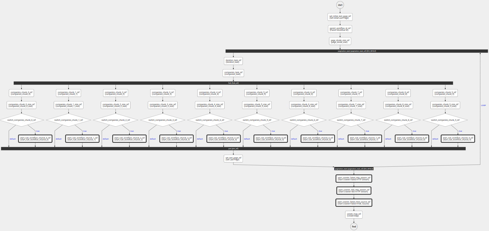
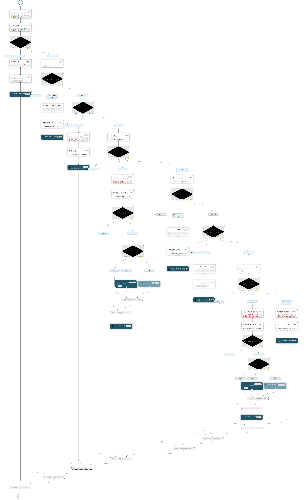

# Coordinatore delle attività di crawling

Il coordinatore è basato su [Netflix - Conductor](https://conductor-oss.org) una piattaforma gratuita e open source per l'orchestrazione dei microservizi, attraverso flussi di lavoro che definiscono le interazioni tra servizi, il progetto principale è stato [forkato](https://github.com/cnr-anac/conductor) per permettere e gestire l'autenticazione e l'autorizzazione sull'esecuzione dei flussi e sul passaggio della stessa ai microservizi invocati dal flusso. 

Nel progetto sono presenti le definizioni in formato *json* dei flussi necessari al completamento degli obiettivi del progetto.

## Main - Amministrazione Trasparente

Il flusso [principale](crawler_amministrazione_trasparente.json) necessita dei seguenti parametri di input per la sua corretta invocazione:

| Nome                       | Descrizione                                                    | Valore consigliato/default  | Vuoto? |
|----------------------------|----------------------------------------------------------------|-----------------------------|--------|
| page_size                  | Dimensione della pagina per il recupero delle PA               | 2000                        | No     |
| parent_workflow_id         | Identificativo del flusso, viene valorizzato con UUID generato | vuoto                       | Si     |
| codice_categoria           | Se valorizzato filtra le PA che fanno parte della categoria    | vuoto                       | Si     |
| codice_ipa                 | Se valorizzato individua la singola PA                         | vuoto                       | Si     |
| crawler_save_object        | Booleano indica se salvare sempre la pagina HTML               | false                       | No     |
| crawler_save_screenshot    | Booleano indica se salvare sempre lo screenshot della pagina   | false                       | No     |
| rule_name                  | Nome della regola                        					  | amministrazione-trasparente | No     |
| root_rule                  | Nome della regola di base dell'albero    					  | amministrazione-trasparente | No     |
| execute_child              | Booleano indica se controllare le regole figlie                | true                        | No     |
| id_ipa_from                | Identificativo numerico della PA da cui partire                | 0                           | No     |  
| connection_timeout         | Timeout in millisecondi della connessione                      | 60000                       | No     | 
| read_timeout               | Timeout in millisecondi della lettura                          | 60000                       | No     | 
| connection_timeout_max     | Timeout massimo in millisecondi della connessione              | 120000                      | No     | 
| read_timeout_max           | Timeout massimo in millisecondi della lettura                  | 120000                      | No     | 
| crawler_child_type         | Modalità di esecuzione dei flussi figli (SUB/START)_WORKFLOW   | START_WORKFLOW              | No     |
| rule_base_url              | URL di base del microservizio delle Regole                     | *URL*                       | No     |
| public_company_base_url    | URL di base del microservizio delle PA                         | *URL*                       | No     |
| result_aggregator_base_url | URL di base del microservizio Aggregato                        | *URL*                       | No     |
| result_base_url            | URL di base del microservizio dei Risultati                    | *URL*                       | No     |
| crawler_uri                | URL di base del microservizio Crawler                          | *URL*                       | No     |

Il primo [TASK](crawler_amministrazione_trasparente.json#L8-L22) del flusso si occupa di invocare l'aggiornamento della configurazione del microservizio delle regole, dopo aver valorizzato la variabile necessaria al controllo delle pagine elaborate, il flusso invoca il [microservizio delle PA](crawler_amministrazione_trasparente.json#L71-L85) e recupera le informazioni necessarie.

Il blocco recuperato contentente le informazioni di *n* PA viene parcellizzato in base al parametro fornito in input **page_size** e diviso per *10*, utilizzando infine il [TASK FORK/JOIN](https://orkes.io/content/reference-docs/operators/fork-join) vengono eseguiti in parallello *10* istanze del flusso [Rule](rule_workflow.json) valorizzando il parametro in input [companies](rule_workflow.json#L278).        

All'uscita del [TASK delle PA](crawler_amministrazione_trasparente.json#L52-L60), se il flusso è stato eseguito non per una singola PA, allora vengono rielaborati i risultati con i codici *400* e *407* con i timeout massimi ed eseguiti i flussi [Crawler Result Failed](crawler_result_failed.json).

Infine viene eseguito il [TASK](crawler_amministrazione_trasparente.json#L581-L596) per elaborare la Mappa geolocalizzata dei risultati.  

Di seguito l'immagine del flusso:

## RULE DETAIL

Il flusso [Rule Detail](rule_detail_workflow.json) eseguito per una singola PA passata come parametro in input [ipa](rule_detail_workflow.json#L860) controlla inizialmente la [presenza della URL istituzionale](rule_detail_workflow.json#L19-L28) e successivamente invoca il [crawler](rule_detail_workflow.json#L38-L52) il cui risultato viene passato al [microservizio delle regole](rule_detail_workflow.json#L76-L92) la cui risposta è utilizzata come input al [Task dei risultati](rule_detail_workflow.json#L261-L277)    

Di seguito l'immagine del flusso:

## SCRIPT UTILI

- [Crea e avvia](create_and_start.sh) Può essere utilizzato per il SETUP iniziale.
- [Cancella workflow](delete_workflow.sh)
- [Avvia workflow](start.sh)
