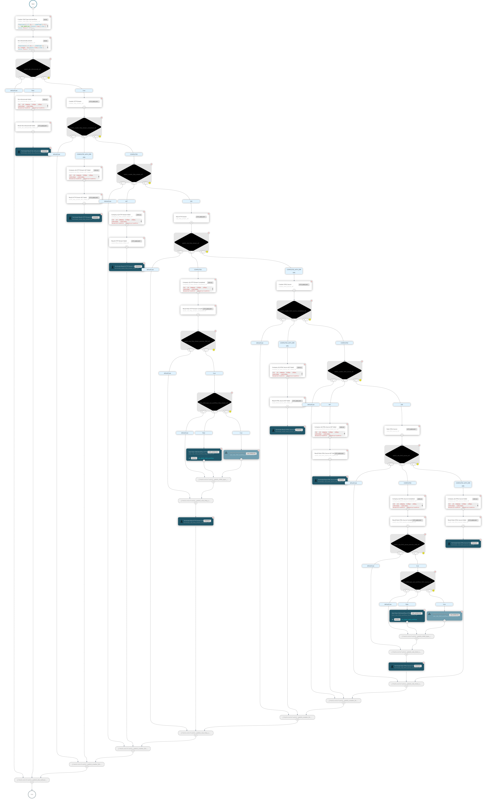

# Coordinatore delle attività di crawling

Il coordinatore è basato su [Netflix - Conductor](https://conductor-oss.org) una piattaforma gratuita e open source per l'orchestrazione dei microservizi, attraverso flussi di lavoro che definiscono le interazioni tra servizi.

Nel progetto sono presenti le definizioni in formato *json* dei flussi necessari al completamento degli obiettivi della piattaforma 

## Main - Amministrazione Trasparente

Il flusso [principale](crawler_amministrazione_trasparente.json)   

