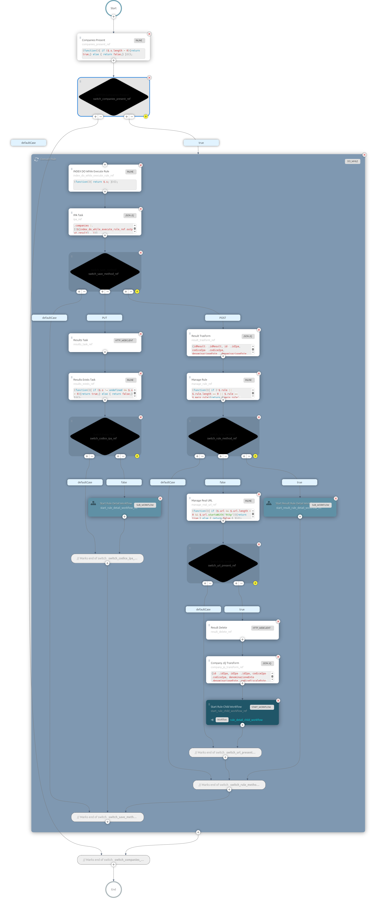

# Coordinatore delle attività di crawling

Il coordinatore è basato su [Netflix - Conductor](https://conductor-oss.org) una piattaforma gratuita e open source per l'orchestrazione dei microservizi, attraverso flussi di lavoro che definiscono le interazioni tra servizi, il progetto principale è sttao [forkato](https://github.com/cnr-anac/conductor) per permettere e gestire l'autenticazione e l'autorizzazione sull'esecuzione dei flussi e sul passaggio della stessa ai microservizi invocati dal flusso. 

Nel progetto sono presenti le definizioni in formato *json* dei flussi necessari al completamento degli obiettivi della piattaforma.

## Main - Amministrazione Trasparente

Il flusso [principale](crawler_amministrazione_trasparente.json) ha bisogno dei seguenti parametri di input per la sua corretta invocazione:

| Nome                       | Descrizione                                                    | Valore consigliato/default  | Vuoto? |
|----------------------------|----------------------------------------------------------------|-----------------------------|--------|
| page_size                  | Dimensione della pagina per il recupero delle PA               | 2000                        | No     |
| parent_workflow_id         | Identificativo del flusso, viene valorizzato con UUID generato | vuoto                       | Si     |
| codice_categoria           | Se valorizzato filtra le PA che fanno parte della categoria    | vuoto                       | Si     |
| codice_ipa                 | Se valorizzato individua la singola PA                         | vuoto                       | Si     |
| crawler_save_object        | Booleano indica se salvare sempre la pagina HTML               | false                       | No     |
| crawler_save_screenshot    | Booleano indica se salvare sempre lo screenshot della pagina   | false                       | No     |
| rule_name                  | Nome della regola                        					  | amministrazione-trasparente | No     |
| root_rule                  | Nome della regola di base dell'albero    					  | amministrazione-trasparente | No     |
| execute_child              | Booleano indica se controllare le regole figlie                | true                        | No     |
| id_ipa_from                | Identificativo numerico della PA da cui partire                | 0                           | No     |  
| connection_timeout         | Timeout in millisecondi della connessione                      | 60000                       | No     | 
| read_timeout               | Timeout in millisecondi della lettura                          | 60000                       | No     | 
| connection_timeout_max     | Timeout massimo in millisecondi della connessione              | 120000                      | No     | 
| read_timeout_max           | Timeout massimo in millisecondi della lettura                  | 120000                      | No     | 
| crawler_child_type         | Modalità di esecuzione dei flussi figli (SUB/START)_WORKFLOW   | START_WORKFLOW              | No     |
| rule_base_url              | URL di base del microservizio delle regole                     | *URL*                       | No     |
| public_company_base_url    | URL di base del microservizio delle PA                         | *URL*                       | No     |
| result_aggregator_base_url | URL di base del microservizio Aggregato                        | *URL*                       | No     |
| result_base_url            | URL di base del microservizio dei Risultati                    | *URL*                       | No     |
| crawler_uri                | URL di base del microservizio Crawler                          | *URL*                       | No     |

Il primo [TASK](crawler_amministrazione_trasparente.json#L8-L22) del flusso si occupa di invocare l'aggiornamento della configurazione del microservizio delle regole.
Dopo aver valorizzato la variabile necessaria al controllo delle pagine elaborate, il flusso invoca il [microservizio delle PA](crawler_amministrazione_trasparente.json#L71-L85) e recupera le informazioni necessarie. Il blocco recuperato viene parcellizzato in base al parametro fornito in input **page_size** diviso per *10* e utilizzando il [TASK FORK/JOIN](https://orkes.io/content/reference-docs/operators/fork-join) vengono eseguiti in parallello *10* flussi [Rule Workflow](rule_workflow.json).        

